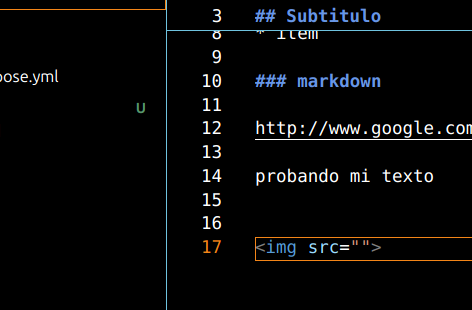

# Titulo
# Rodrigo Rolando

## Subtitulo

lipsum lorem texto

* lista
* item

### markdown

http://www.google.com

probando mi texto




Voy a importar mi biblioteca de  `pandas` usando  `import pandas as pd` 

```python
import pandas as pd
import numpy as np

def main():
    print("hola)
```


| 1 | 3 |
|---|---|
| 5 | 4 |
| 5 | 6 |
| 5 | 5 |